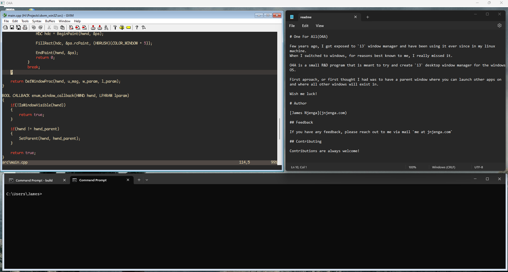

# One For All(O4A)

O4A is a small R&D program that is meant to try and create lightweight tile based desktop window manager for the windows OS like [i3wm](https://i3wm.org/).

# Author

[James Njenga](jnjenga.com)

## Feedback

If you have any feedback, please reach out to me via mail `me at jnjenga.com`
  
## Contributing

Contributions are always welcome!
